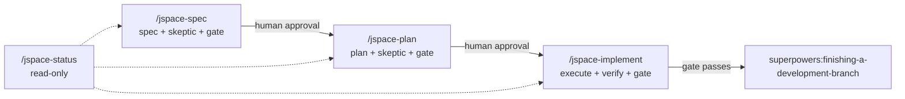

<p align="center">
  
  <br>
  
  
  
</p>

# J-Space Skills

**Epistemic-control skills for Claude Code.** Make assumptions explicit, falsify specifications and implementation plans *before* they fail, and gate every promotion on evidence rather than confidence.

The name — and the discipline — comes from Anthropic's [J-space research](https://transformer-circuits.pub/2026/workspace/index.html): a small, privileged set of internal representations where a model holds what it is poised to say, distinct from everything automatic running beneath it. These skills keep the same kind of record for your repository: a small, explicit, auditable state of what is currently believed, doubted, decided, and verified — so no claim of "done" survives an unanswered doubt.

> These are engineering tools inspired by that research. They never ask Claude to introspect, report privileged access to its internals, or persist chain-of-thought to disk.

## What this adds

The [`obra/superpowers`](https://github.com/obra/superpowers) collection already owns exploration, specification, planning, TDD, review, and branch completion. J-Space Skills add an **external boundary of epistemic control** around those workflows without duplicating them:

| Concept | What it does |
|---|---|
| **Doubts** | Compact, testable statements about what could make an artifact wrong — each with severity (`critical` / `major` / `minor`) and a disposition (`open`, `resolved`, `accepted_risk`, `deferred`) |
| **Evidence** | Concrete, findable locators (file:line, test name, command, document section) for or against each doubt. "Claude thinks so" is never promoted to evidence |
| **Adversarial review** | A fresh, read-only Explore subagent tries to *falsify* every specification and plan before they advance |
| **Hash-bound trust** | Reviews and approvals are pinned to the SHA-256 of the artifact at the time. Edit the file afterwards and the marker goes stale |
| **Promotion gates** | A deterministic Python controller blocks stage transitions until the gate conditions hold — it never judges whether your prose is correct |

The state lives in one place: `.jspace/state.json` at the repository root, schema version 1.

## How a workflow runs



1. **Spec** — `superpowers:brainstorming` creates the specification; a skeptic pass attacks it; the spec gate blocks planning until the doubts are settled and you approve the final hash.
2. **Plan** — `superpowers:writing-plans` builds the implementation plan from the approved spec; a second skeptic pass falsifies it; the plan gate blocks implementation until doubts are settled and you approve.
3. **Implement** — Superpowers runs the plan with a compact **Doubt Context** carried in; reviews and verification proceed as normal; a verification artifact records what was actually tested; the implement gate blocks branch completion until epistemic closure.
4. **Status** — `/jspace-status` reports stage, artifacts, open doubts, approvals, and deterministic blockers without mutating anything.

## The five skills

| Skill | Invocation | Purpose |
|---|---|---|
| `jspace-spec` | `/jspace-spec <ticket, problem, or source material>` | Specification + adversarial review + promotion gate |
| `jspace-plan` | `/jspace-plan <approved specification path>` | Implementation plan + adversarial review + promotion gate |
| `jspace-implement` | `/jspace-implement <approved implementation plan path>` | Execute with doubt context, verify, gate before branch completion |
| `jspace-status` | `/jspace-status` | Read-only workflow status and blockers |
| `jspace-core` | *(never invoked directly)* | Shared controller script and reference protocols |

The skills are **project-local**: they are designed to be copied into a target repository's `.claude/skills/` directory, so each project carries its own workflow state in `.jspace/`.

## Requirements

- **Claude Code**
- **[`obra/superpowers`](https://github.com/obra/superpowers)** installed (hard dependency — the skills invoke Superpowers skills and stop with a clear error if the collection is missing; they never substitute their own versions of its procedures)
- **Python 3** — the controller uses the standard library only: no dependencies, no network, writes exactly one directory (`.jspace/`)

## Costs

These skills add token overhead on top of the Superpowers workflows they wrap. Every spec and plan is attacked by a fresh, read-only Explore skeptic subagent; every edit to an artifact changes its hash and forces a fresh skeptic pass; and the gated implementation runs the full Superpowers execution machinery inside it. Expect noticeably higher token consumption than bare Superpowers workflows.

## Installation

```bash
git clone https://github.com/abraxarion/J-Space-Skills.git
cp -r J-Space-Skills/skills/jspace-* /path/to/your/repo/.claude/skills/
```

Runtime state belongs in the repository root at `.jspace/`; workflow state is never stored inside `.claude/skills/`. Whether `.jspace/` is versioned is your call: add it to `.gitignore` to keep the workflow state local and per-developer, or commit it to share the audit trail of doubts, approvals, and gates with the team.

## Usage

Happy path, inside a repo with the skills installed:

```text
/jspace-spec "Ticket 123: add rate limiting"        # spec + skeptic review + gate
/jspace-plan specs/123-rate-limiting.md             # plan + skeptic review + gate
/jspace-implement plans/123-rate-limiting.md        # implement + verify + gate
/jspace-status                                      # where are we, and what blocks us?
```

Every stage ends with a human approval step. If you change a spec or plan after review, the hash changes — the workflow re-registers the artifact and runs a fresh skeptic pass before the gate can open.

### Promotion gates

| Gate | Requires (all conditions) |
|---|---|
| `spec` | registered spec with current hash · skeptic review for that exact hash · no open critical/major spec doubts |
| `plan` | everything above for the plan · current human-approved spec · plan linked to that spec as its source |
| `implement` | current human-approved plan · blocking doubts explicitly disposed · at least one evidence record · current verification artifact |

### The controller

`jspace.py` is the deterministic state machine behind the gates:

```bash
python .claude/skills/jspace-core/scripts/jspace.py init     --title "..." --goal "..."
python .claude/skills/jspace-core/scripts/jspace.py status   --json
python .claude/skills/jspace-core/scripts/jspace.py artifact register --kind spec --path <file>
python .claude/skills/jspace-core/scripts/jspace.py doubt    add --stage spec --severity major --claim "..."
python .claude/skills/jspace-core/scripts/jspace.py evidence add --kind test --summary "..." --locator "<test/command>"
python .claude/skills/jspace-core/scripts/jspace.py review   record --stage spec --artifact-id A-001 --reviewer explore-spec-skeptic
python .claude/skills/jspace-core/scripts/jspace.py approval record --stage spec --artifact-id A-001 --by human
python .claude/skills/jspace-core/scripts/jspace.py gate     spec
python .claude/skills/jspace-core/scripts/jspace.py stage    set plan
```

Exit codes: `0` passed, `1` malformed command/state/input, `2` a deterministic workflow gate or state transition is blocked.

### State schema

```json
{
  "schema_version": 1,
  "workflow_id": "uuid",
  "title": "Ticket 123",
  "stage": "spec",
  "goal": "Desired outcome",
  "artifacts": [{ "id": "A-001", "kind": "spec", "path": "specs/...", "sha256": "..." }],
  "doubts":    [{ "id": "D-001", "stage": "spec", "severity": "critical", "status": "open" }],
  "evidence":  [],
  "decisions": [],
  "approvals": [{ "stage": "spec", "artifact_id": "A-001", "sha256": "..." }],
  "reviews":   [{ "stage": "spec", "artifact_id": "A-001", "sha256": "..." }],
  "created_at": "UTC timestamp",
  "updated_at": "UTC timestamp"
}
```

## Design boundaries

- **Never persist chain-of-thought.** Doubts, evidence, and verifications store conclusions and locators only — no hidden reasoning, no scratch traces, no introspection claims.
- **Deterministic gates only.** The controller checks hashes, severities, dispositions, and markers. It never judges whether prose or code is correct.
- **No-copy rule.** When a workflow reaches an engineering responsibility owned by Superpowers, the named Superpowers skill is invoked and followed exactly. J-Space adds boundary conditions; it does not rebuild the methodology.

## Research basis

The skills are inspired by Anthropic's global workspace research:

- Wes Gurnee, Nicholas Sofroniew, Jack Lindsey, et al., [*Verbalizable Representations Form a Global Workspace in Language Models*](https://transformer-circuits.pub/2026/workspace/index.html), Transformer Circuits Thread, July 6, 2026 — [arXiv:2607.15495](https://arxiv.org/abs/2607.15495)
- Anthropic, [*A global workspace in language models*](https://www.anthropic.com/research/global-workspace) (research post), July 6, 2026

## License

Released under the [Apache License 2.0](LICENSE).

Concepts inspired by the [J-Space Cognition Suite V3.6](https://github.com/Tiger3807861189/J-Space-Cognition-Suite-V3.6) (Apache-2.0) by Tiger3807861189.

## Citation

Cite this repository via the `CITATION.cff` file — GitHub renders a "Cite this repository" button from it. For the underlying science, please also cite Gurnee et al. (2026), linked above.
